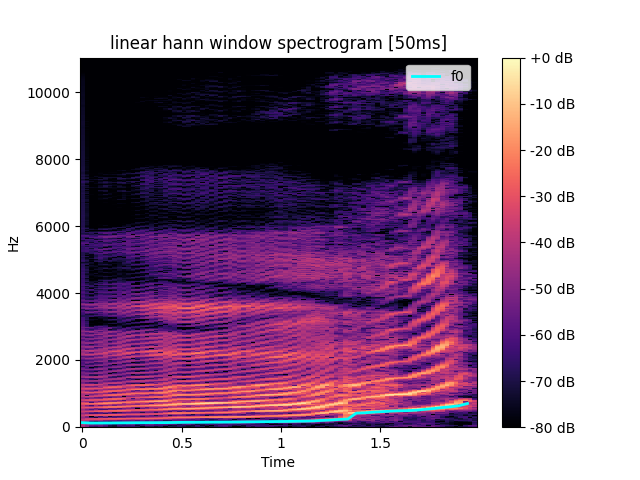
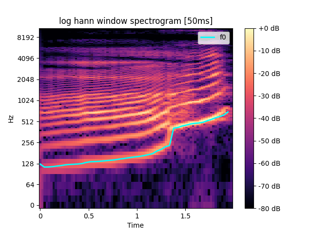
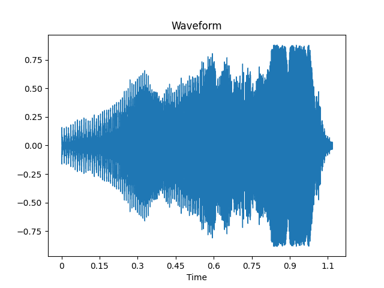
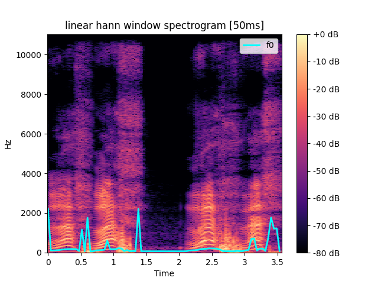
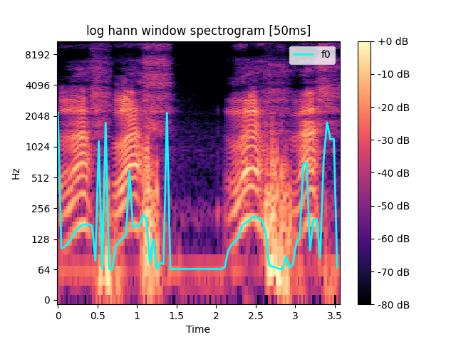
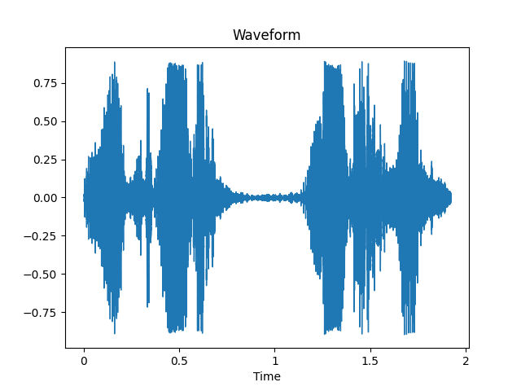
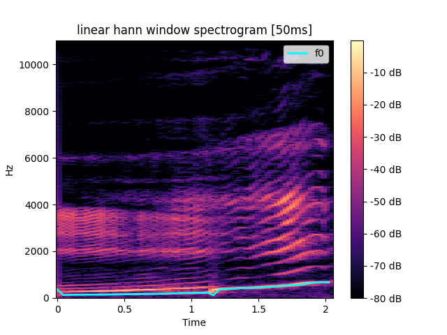
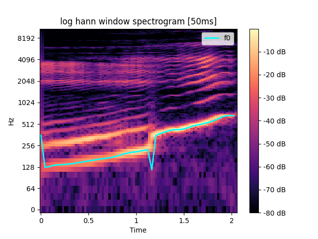
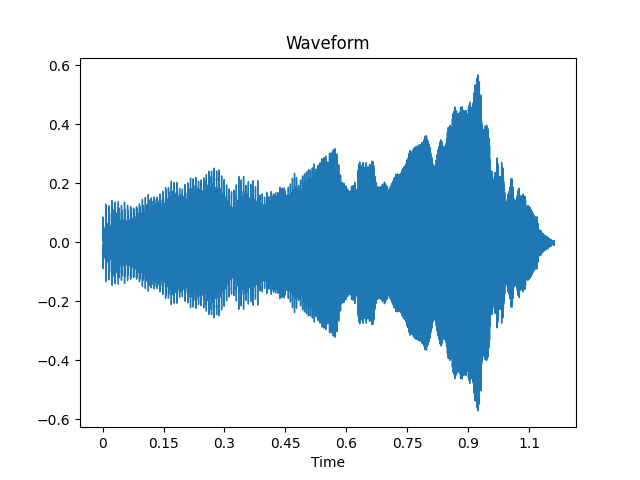

### Лабораторная работа №10. Обработка голоса
> Программное обеспечение:
- Утилита ffmpeg (сайт www.ffmpeg.org).
- Библиотеки python на выбор: numpy, pydub, scipy.signal, matplotlib.pyplot,
pylab, pywt, pyWavelets, librosa и другие.

1. Каждый студент c помощью микрофона записывает звуковые дорожки в формате
*.wav (можно и mp3, но не все библиотеки с ходу его понимают, и лучше один
канал, чтоб стерео не мешало):
    - Образец собственного голоса для звука «А» с максимальным частотным
диапазоном (от баса до визга и даже фальцета), так чтобы громкость была
более-менее одинаковой. Длительность до 10 секунд.
    - Образец собственного голоса для звука «И», аналогично.
    - Имитация собачьего лая (молодые люди) и мяуканья (девушки).
2. Построить спектрограммы и сохранить в файл, пользуясь оконным
преобразованием Фурье с окном Ханна (например). Частоты имеет смысл
визуализировать на логарифмической шкале.
3. Найти минимальную и максимальную частоту голоса.
4. Найти наиболее тембрально окрашенный основной тон – частота, для которой
прослеживается наибольшее количество обертонов.
5. Найти три самые сильные форманты для издаваемых звуков – частоты с
наибольшей энергией в некоторой окрестности по времени. 

```log
For file ./labs/lab_10/input/a.wav:
Top 3 formants by energy:
Formant 689.0625 energy = 1318.0057
Formant 549.0966796875 energy = 1130.2692
Formant 484.4970703125 energy = 1129.4559
Min frequency: 139.9658203125
Max frequency: 3552.978515625
Formant 1 = 484.4970703125
Formant 2 = 689.0625
Formant 3 = 968.994140625
Formant 4 = 2185.6201171875
Fundamental frequency: 299.1290591459905

For file ./labs/lab_10/input/gav.wav:
Top 3 formants by energy:
Formant 64.599609375 energy = 1634.169
Formant 172.265625 energy = 1199.6791
Formant 678.2958984375 energy = 917.0255
Min frequency: 64.599609375
Max frequency: 3036.181640625
Formant 1 = 64.599609375
Formant 2 = 1033.59375
Formant 3 = 1259.6923828125
Formant 4 = 2271.7529296875
Fundamental frequency: 116.89747775605122

For file ./labs/lab_10/input/i.wav:
Top 3 formants by energy:
Formant 430.6640625 energy = 673.6195
Formant 506.0302734375 energy = 418.26508
Formant 215.33203125 energy = 381.8176
Min frequency: 215.33203125
Max frequency: 667.529296875
Formant 1 = 215.33203125
Formant 2 = 333.7646484375
Formant 3 = 430.6640625
Formant 4 = 506.0302734375
Fundamental frequency: 317.67203855335345
```

### **Examples**









