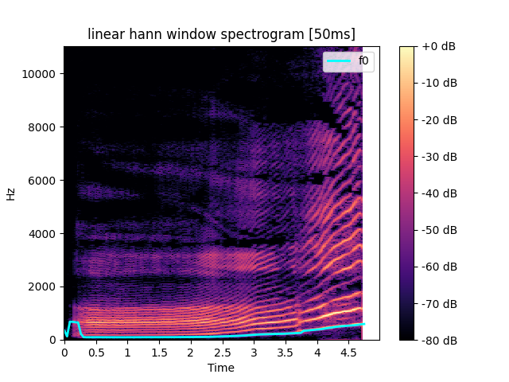
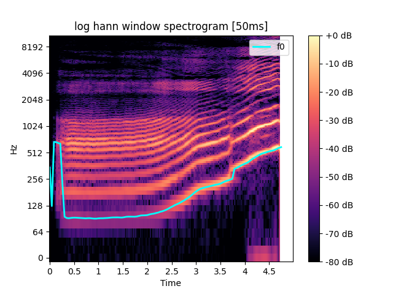
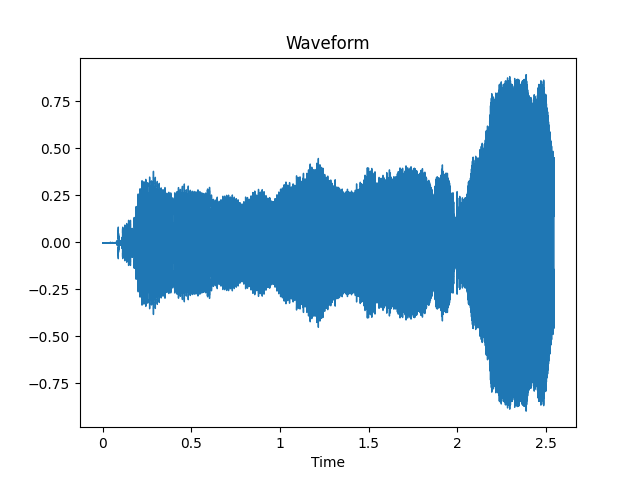
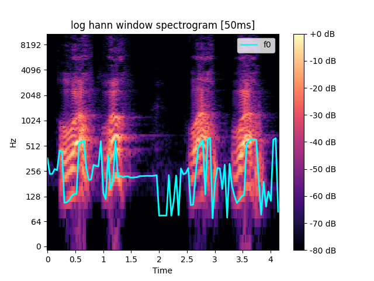
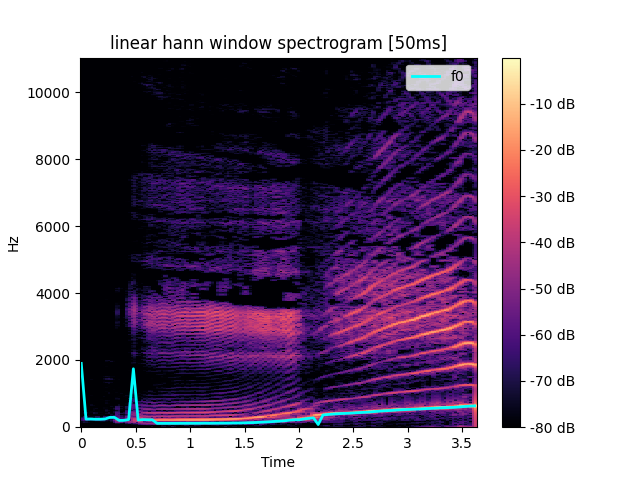
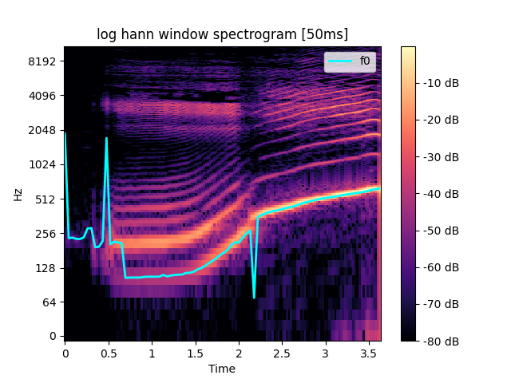

### Лабораторная работа №10. Обработка голоса
> Программное обеспечение:
- Утилита ffmpeg (сайт www.ffmpeg.org).
- Библиотеки python на выбор: numpy, pydub, scipy.signal, matplotlib.pyplot,
pylab, pywt, pyWavelets, librosa и другие.

1. Каждый студент c помощью микрофона записывает звуковые дорожки в формате
*.wav (можно и mp3, но не все библиотеки с ходу его понимают, и лучше один
канал, чтоб стерео не мешало):
    - Образец собственного голоса для звука «А» с максимальным частотным
диапазоном (от баса до визга и даже фальцета), так чтобы громкость была
более-менее одинаковой. Длительность до 10 секунд.
    - Образец собственного голоса для звука «И», аналогично.
    - Имитация собачьего лая (молодые люди) и мяуканья (девушки).
2. Построить спектрограммы и сохранить в файл, пользуясь оконным
преобразованием Фурье с окном Ханна (например). Частоты имеет смысл
визуализировать на логарифмической шкале.
3. Найти минимальную и максимальную частоту голоса.
4. Найти наиболее тембрально окрашенный основной тон – частота, для которой
прослеживается наибольшее количество обертонов.
5. Найти три самые сильные форманты для издаваемых звуков – частоты с
наибольшей энергией в некоторой окрестности по времени. 

### **Examples**

