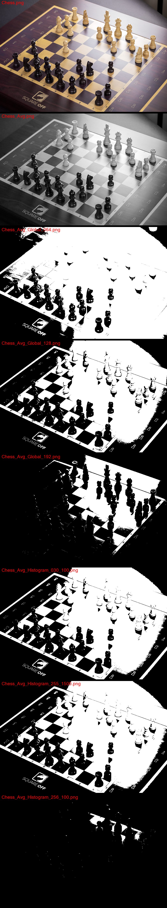
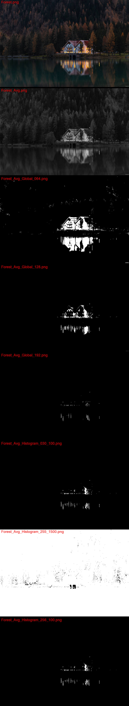
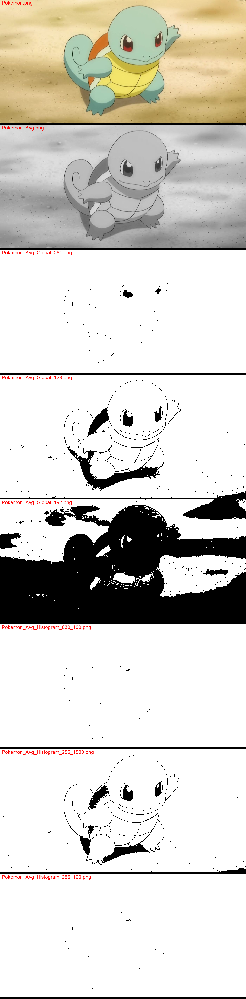

### Лабораторная работа №2. Обесцвечивание и бинаризация растровых изображений
> Каждый студент выполняет все задания. Библиотечные функции приведения к
полутону, бинаризации не использовать. В качестве исходных изображений использовать
полноцветные трёхканальные изображения в форматах bmp или png (не jpeg).
Демонстрируется результат каждой операции (до и после).

Задания:
1. Приведение полноцветного изображения к полутоновому. Новое изображение
создаётся в режиме полутона (1 яркостный канал, формат bmp), где яркость
каждого пикселя вычисляется (взвешенным) усреднением каналов исходного
полноцветного изображения.
2. Приведение полутонового изображения к монохромному методом пороговой
обработки. Демонстрируется на нескольких изображениях, например: контурная
карта, рентгеновский снимок, скриншот из мультфильма, фотография, отпечаток
пальца, неравномерно засвеченная страница текста.

Варианты алгоритмов пороговой обработки:
1. **Алгоритм сбалансированного порогового отсечения гистограммы.**
2. Алгоритм глобальной бинаризации с двумя порогами.
3. Алгоритм глобальной бинаризации с критерием Отсу.
4. Алгоритм адаптивной бинаризации Ниблэка.
5. Алгоритм адаптивной бинаризации Кристиана.
6. Улучшенный алгоритм адаптивной бинаризации Бернсена.
7. Алгоритм адаптивной бинаризации Эйквила.
8. Алгоритм адаптивной бинаризации Саувола.
9. Алгоритм адаптивной бинаризации Брэдли и Рота.
10. Алгоритм бинаризации Чоу и Канеко. 

### **Examples**

