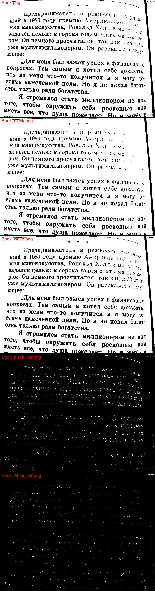
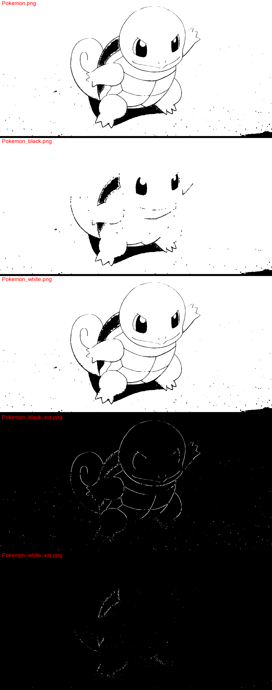
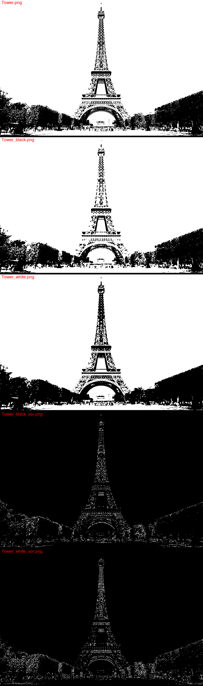

## Лабораторная работа №2. Фильтрация изображений и морфологические операции
> В качестве входных данных берётся монохромное (или полутоновое, где уместно)
изображение (несколько штук). 

В качестве выходных данных демонстрируется:
1. Отфильтрованное монохромное изображение
2. Разностное изображение (попиксельный xor или модуль разности).
* Для методов фильтрации полутоновых изображений дополнительно можно
попытаться применить результаты к цветному изображению, из которого было
получено начальное полутоновое изображение.

Выполняется одно задание на выбор:
1. Фильтрация методом пространственного сглаживания;
2. Фильтрация методом консервативного сглаживания;
3. Фильтрация медианным фильтром с ядром в виде равнины (единичные веса),
креста прямого, креста косого;
4. Фильтрация медианным фильтром с ядром в виде холма (приоритет центра и
соседей), в виде впадины (приоритет углов и соседей, в центре 1);
5. Фильтрация логическим фильтром;
6. Фильтрация ранговым фильтром;
7. Фильтрация методом преобладающего оттенка;
8. Фильтр "стирание бахромы";
9. Операция морфологического расширения Dilation;
10. Операция морфологического сжатия Erosion;
11. **Операция морфологического открытия Opening;**
12. Операция морфологического закрытия Closing. 

### **Examples**

