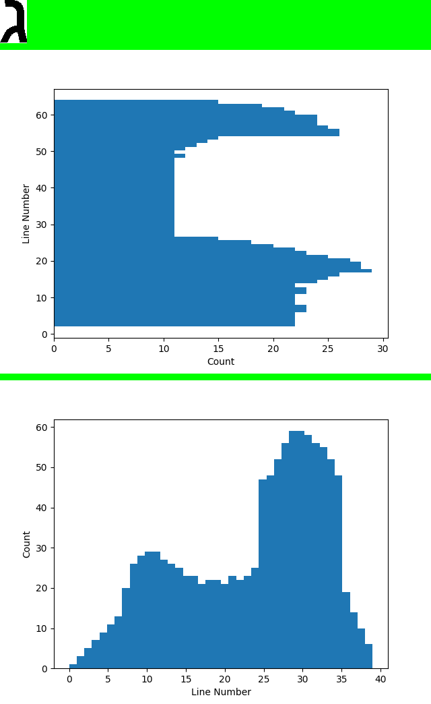
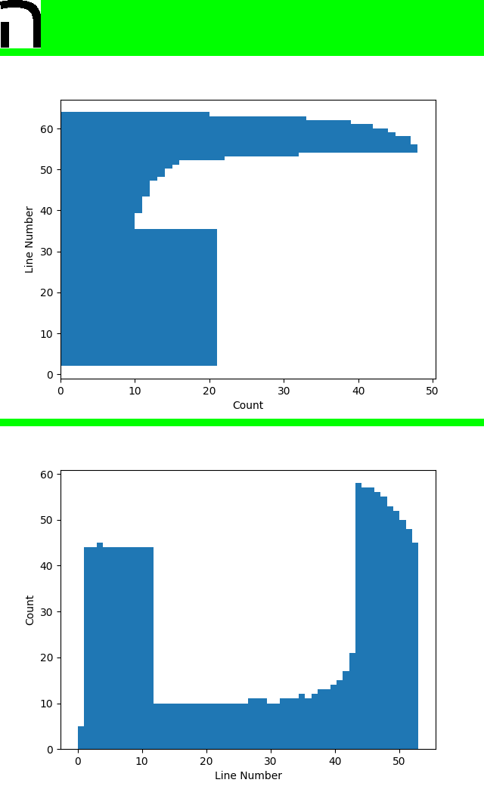
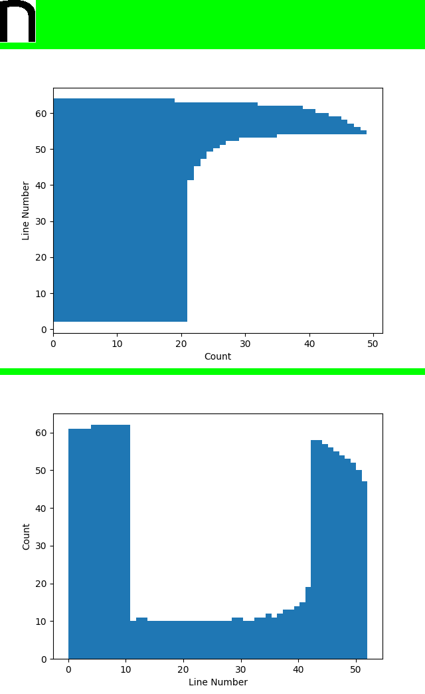
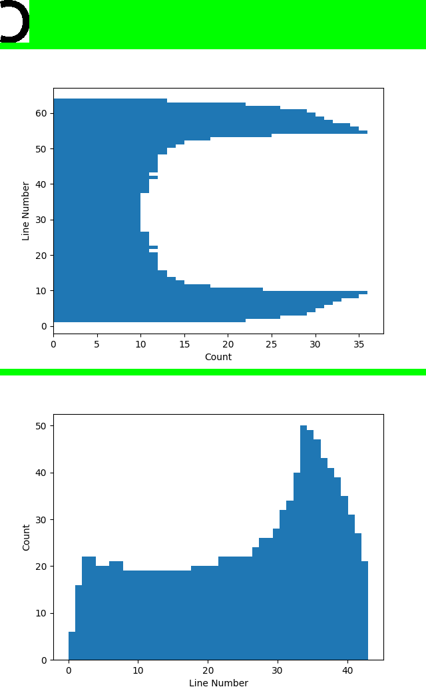
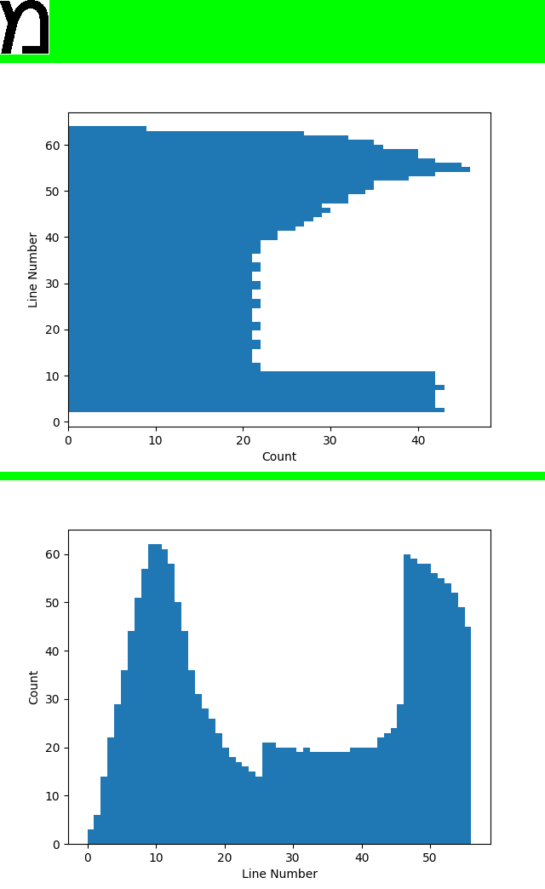
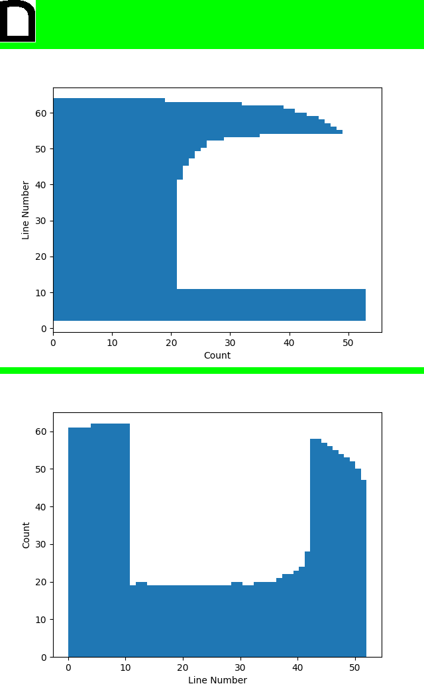
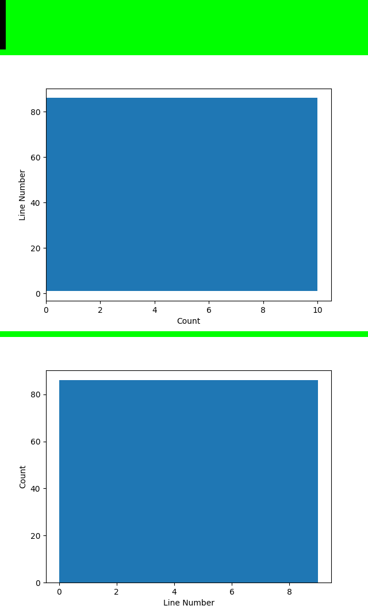
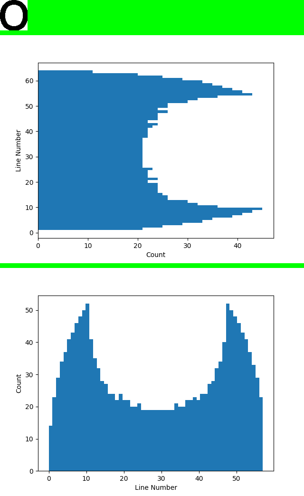
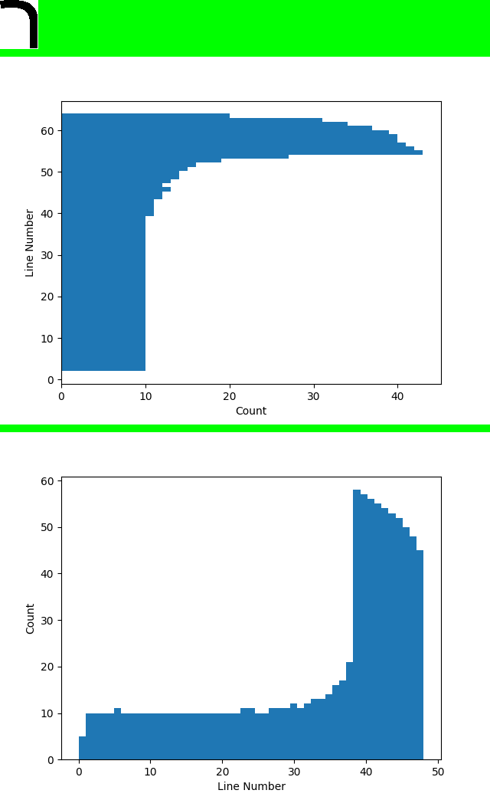
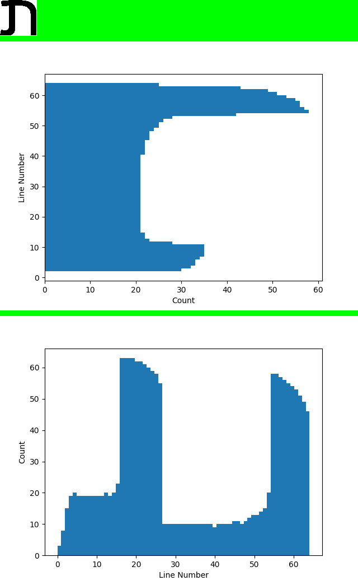

## Лабораторная работа №5. Выделение признаков символов

> Каждый студент выполняет все задания на выбранном алфавите.

I. Сгенерировать эталонные изображения символов. Лучше сразу обрезать белые
поля, чтобы не мешались потом в следующих лабораторных.
Бакалавры работают как минимум с одним шрифтом, размером, регистром букв.
Например, шрифт Times New Roman, кегль 52 (параметр). Сохранить в папку по принципу
"1 символ - 1 файл".

### Алфавиты на выбор
1. `Арабский алфавит`
أ ب ج د ه و ز ح ط ي ك ل م ن س ع ف ص ق ر ش ت ث خ ذ ض ظ غ 
2. `Алфавит Гурмукхи`  
https://symbl.cc/ru/alphabets/gurmukhi/
3. `Глаголица`  
https://symbl.cc/ru/alphabets/glagolitic/
4. `Персидский алфавит` 
ا ب پ ت ث ج چ ح خ د ذ ر ز ژ س ش ص ض ط ظ ع غ ف ق ک گ ل م ن و ه ی  
5. **Иврит**
א ב ג ד ה ו ז ח ט י כ ך ל מ ם נ ן ס ע פ ף צ ץ ק ר ש ת א ל 
4. `Персидский алфавит` 
ا ب پ ت ث ج چ ح خ د ذ ر ز ژ س ش ص ض ط ظ ع غ ف ق ک گ ل م ن و ه ی 
6. `Османья`  
https://symbl.cc/ru/alphabets/osmanya/
7. `Сингальский алфавит`  
https://symbl.cc/ru/alphabets/sinhala/
8. `Тибетский алфавит`  
https://symbl.cc/ru/alphabets/tibetan/
9. `Угаритский алфавит`   
https://symbl.cc/ru/alphabets/ugaritic/
10. `Греческие заглавные буквы` 
AΒΓΔΕΖΗΘΙΚΛΜΝΞΟΠΡΣΤΥΦΧΨΩ
11. `Греческие строчные буквы` 
αβγδεζηθικλμνξοπρστυφχψω
12. `Испанские заглавные буквы`  
ABCDEFGHIJKLMNÑOPQRSTUVWXYZ
13. `Испанские строчные буквы`  
abcdefghijklmnñopqrstuvwxyz
14. `Казахские заглавные буквы`  
АӘБВГҒДЕЁЖЗИЙКҚЛМНҢОӨПРСТУҰҮФХҺЦЧШЩЪЫІЬЭЮЯ
15. `Казахские строчные буквы`  
аәбвгғдеёжзийкқлмнңоөпрстуұүфхһцчшщъыіьэюя
16. `Грузинские буквы`  
აბგდევზთიკლმნოპჟრსტუფქღყშჩცძწჭხჯჰ
17. `Турецкие заглавные буквы`  
ABCÇDEFGĞHIİJKLMNOÖPRSŞTÜVYZ
18. `Турецкие строчные буквы`  
abcçdefgğhiijklmnoöprsştüvyz
19. `Армянские заглавные буквы`  
ԱԲԳԴԵԶԷԸԹԺԻԼԽԾԿՀՁՂՃՄՅՆՇՈՉՊՋՌՍՎՏՐՑՒՓՔևՕՖ
20. `Армянские строчные буквы`  
աբգդեզէըթժիլխծկհձղճմյնշոչպջռսվտրցուփքևօֆ
21. `Русские заглавные буквы`  
АБВГДЕЁЖЗИЙКЛМНОПРСТУФХЦЧШЩЪЫЬЭЮЯ
22. `Русские строчные буквы`  
абвгдеёжзийклмнопрстуфхцчшщъыьэюя
23. `Английские заглавные буквы`  
ABCDEFGHIJKLMNOPQRSTUVWXYZ
24. `Английские строчные буквы`  
abcdefghijklmnopqrstuvwxyz
25. `Русские заглавные курсивны`  
АБВГДЕЁЖЗИЙКЛМНОПРСТУФХЦЧШЩЪЫЬЭЮЯ
26. `Русские строчные курсивные`  
абвгдеёжзийклмнопрстуфхцчшщъыьэюя
27. `Английские заглавные курси`  
ABCDEFGHIJKLMNOPQRSTUVWXYZ
28. `Английские строчные курсив`  
abcdefghijklmnopqrstuvwxyz 

--- 

II. Для каждого изображения рассчитать набор признаков. 
Признаки:

1. Вес (масса чёрного) каждой четверти изображения символа
1. Удельный вес (вес, нормированный к четверти площади)
1. Координаты центра тяжести
1. Нормированные координаты центра тяжести
1. Осевые моменты инерции по горизонтали и вертикали
1. Нормированные осевые моменты инерции
1. Профили X и Y

---

III. Скалярные признаки сохранить в текстовый файл формата *.csv (таблица, где
значения в строках разделены точкой с запятой), профили сохранить в *.png в виде
столбчатой диаграммы с правильной ориентацией и целыми числами в подписях
на осях.

Nota bene: Изображения символов в отчет вставлять так, чтобы фон изображения не
сливался с фоном Word (например, в рамке или инвертированном виде). 

### **Examples**

