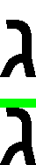
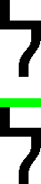
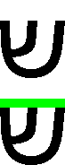

## Лабораторная работа №6. Сегментация текста
> Каждый студент выполняет все задания для собственного алфавита.

1. Подготовить текст из одной строки в Microsoft Word, пользуясь выбранным
алфавитом и теми же параметрами шрифта. Сделать скриншот и сохранить в
монохромный файл *.bmp, так чтобы вокруг строки не было белого фона.
2. Реализовать алгоритм расчёта горизонтального и вертикального профиля
изображения.
3. Реализовать алгоритм сегментации символов в строке на основе профилей с
прореживанием. В результате работы алгоритма возвращается массив с
координатами обрамляющих символы прямоугольников, упорядоченные в порядке
чтения слева направо, сверху вниз. Продемонстрировать либо вырезанные буквы,
либо нарисовать окаймляющие прямоугольники.
4. Построить профили символов выбранного алфавита.
5. *[Дополнительно можно реализовать алгоритм выделения строк из абзацев и
алгоритм выявления обрамляющего прямоугольника для текста в целом.]*

> Nota bene: Изображения символов в отчет вставлять так, чтобы фон изображения не
сливался с фоном Word (например, в рамке или инвертированном виде).

Идеи сегментации для курсива:
1. Проецировать профиль на наклонную ось.
2. Резать не только там, где профиль нулевой, а до некоторого порога в 1-2 пикселя.
3. Хитрым образом сдвинуть пиксельные строки, чтобы свести курсив к обычному
шрифту. 

### **Examples**

