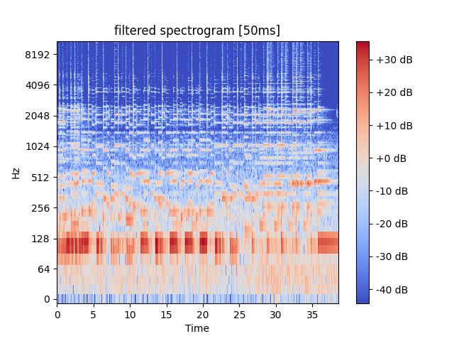
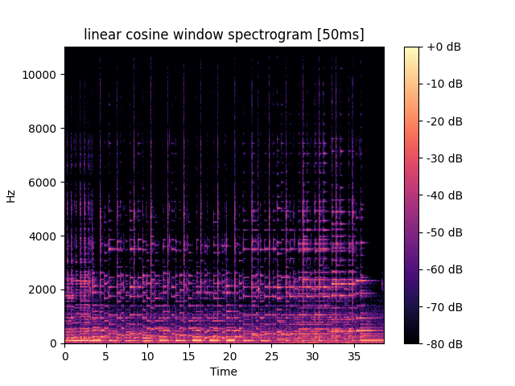
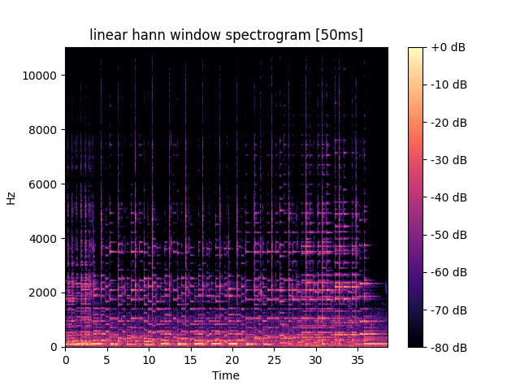
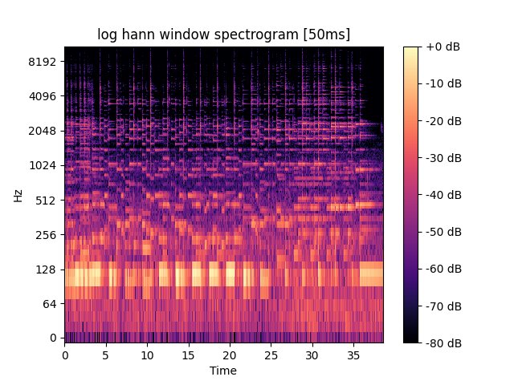
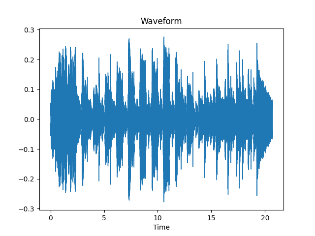

### Лабораторная работа №9. Анализ шума

> Программное обеспечение:
- Утилита ffmpeg (сайт www.ffmpeg.org)
- Библиотеки python на выбор: numpy, pydub, scipy.signal, matplotlib.pyplot,
pylab, pywt, pyWavelets, librosa и другие.

1. С помощью микрофона записать музыкальный инструмент (гитара, пианино,
флейта и т.п.) в формате *.wav (можно и mp3, но не все библиотеки с ходу его
понимают, и лучше один канал, чтоб стерео не мешало).
2. Построить спектрограмму и сохранить в файл, пользуясь оконным
преобразованием Фурье с окном Ханна (например). Частоты имеет смысл
визуализировать на логарифмической шкале.
3. Оценить уровень шума. Попробовать вычесть шум и сравнить спектрограммы до и
после.
4. Найти моменты времени, характеризующиеся наибольшей энергией. 

### **Examples**

